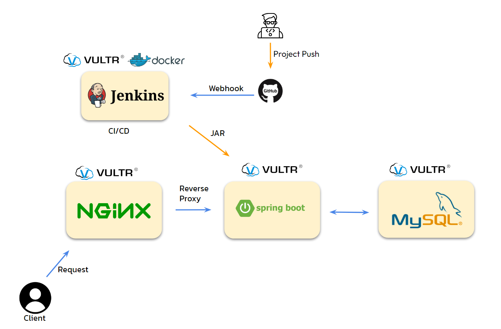

# Bob.zip Project
* A service where users can share and search recipes, and register ingredients from their refrigerator to find matching recipes.

## Table of Contents
1. [Development Environment](#development-environment)
2. [Tech Stack](#tech-stack)
3. [Project Goals](#project-goals)
4. [System Architecture](#system-architecture)
5. [ER Diagram](#er-diagram)
6. [Feature Implementation](#feature-implementation)

## Development Environment
  - Intellij
  - PostMan
  - GitHub
  - SourceTree
  - Visual Studio Code

## Tech Stack
### Backend
#### Key Frameworks / Libraries
  - JAVA 17 Open Jdk
  - Spring MVC
  - Spring Boot 3.2.5
  - Spring Data JPA
  - QueryDsl

#### Build Tool
  - Gradle

#### DataBase
  - MySQL (Production) / H2 (Development)

#### Infra
  - Vultr Cloud Compute
  - Jenkins
  - Nginx
  - Docker

### Frontend
  - HTML/CSS
  - JavaScript/JQuery
  - Thymeleaf
  - BootStrap 5

## Project Goals
  - To **independently experience the entire web application lifecycle**, from initial planning to final deployment.
  - To gain a deep understanding and proficiency in core Spring MVC functionalities.
  - To design the application domain effectively using JPA.
  - To improve JavaScript skills and gain hands-on experience with AJAX asynchronous processing.

## System Architecture

## ER Diagram

## Feature Implementation
### User Management
- Implemented user registration, withdrawal, and login features using **HttpSession**.
- Handled validation for required fields and duplicate user checks during sign-up using [Custom BeanValidation](https://flowerdragon95.tistory.com/196).
- Utilized **Interceptors** to perform login verification for all requests requiring authentication. [Interceptor](https://flowerdragon95.tistory.com/197).

### Recipe Management
#### Recipe Registration
- Implemented core CRUD functionalities for recipes. [Recipe modification with MultipartFile](https://flowerdragon95.tistory.com/202).
- Used JavaScript to dynamically create/delete input forms for recipe registration and to preview uploaded images.
- Applied the **Builder Pattern** for flexible creation of the Recipe entity, which has multiple entity relationships. [Builder Pattern](https://flowerdragon95.tistory.com/195).

#### Recipe Search
  - Implemented [Pagination (JavaScript)](https://flowerdragon95.tistory.com/201) for recipe search results.
  - Resolved a [JPA Entity Identity Problem](https://flowerdragon95.tistory.com/200) when verifying if the current user is the recipe author.
  - Configured a [Resource Handler Configuration](https://flowerdragon95.tistory.com/199) to reference external image files.
  - Used [@ExceptionHandler for Exception Handling](https://flowerdragon95.tistory.com/XXX) to manage exceptions for unauthorized delete requests or "no results" searches. (Note: Link was empty)

#### Recipe "Likes"
  - Retrieves the total "like" count for a recipe.
  - Displays a filled heart for users who have "liked" a recipe; users can toggle the "like" on and off. (API)
  - Users can view a collection of all recipes they have "liked".

### Refrigerator Management
- Users can register ingredients to their refrigerator.
- Users can search for recipes that can be made with their registered ingredients.
  - Search results are sorted by the number of available ingredients, displaying "available" vs. "needed" ingredients for each recipe.
  - [Using Querydsl to search recipes with refrigerator ingredients](https://flowerdragon95.tistory.com/207)

### Comment Management
- Implemented full CRUD functionality for comments on recipes.
  - [Fetching comments via AJAX request](https://flowerdragon95.tistory.com/204), [Creating comments](https://flowerdragon95.tistory.com/205), [Updating comments](https://flowerdragon95.tistory.com/206).
