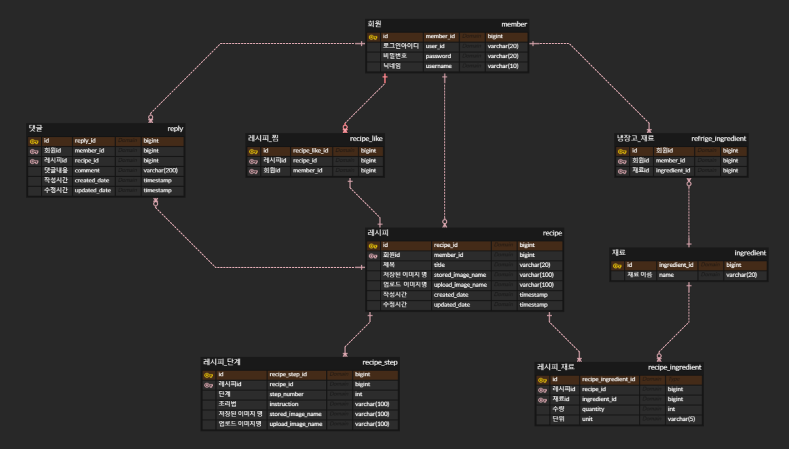

# bobzip 프로젝트
* 사용자가 자신의 레시피를 공유, 검색하고  냉장고에 있는 재료를 등록하여 해당 재료로 만들 수 있는 레시피를 찾을 수 있는 서비스

## 목차
1. [개발환경](#개발환경)
2. [사용기술](#사용기술)
3. [프로젝트 목표](#프로젝트-목표)
4. [ER 다이어그램](#er-다이어그램)
5. [기능 구현](#기능-구현)

## 개발환경
  - Intellij
  - PostMan
  - GitHub
  - SourceTree
  - Visual Studio Code

## 사용기술
### 백엔드
#### 주요 프레임워크 / 라이브러리
  - JAVA 17 Open Jdk
  - Spring MVC
  - Spring Boot 3.2.5
  - Spring Data JPA
  - QueryDsl

#### Build Tool
  - Gradle

#### DataBase
  - H2 (개발) / MySQL(배포)

#### infra
  - Vultr Cloud Compute

### 프론트엔드 
  - HTML/CSS
  - JavaScript/JQuery
  - Thymeleaf
  - BootStrap 5

## 프로젝트 목표
  - Spring MVC의 주요 기능 이해와 숙달
  - JPA 및 Hibernate 활용한 도메인 설계
  - JavaScript 활용능력 향상과 AJAX 비동기 요청 처리 경험
  - 웹 애플리케이션의 기획부터 배포까지의 전 과정을 경험

## ER 다이어그램

## 기능 구현
### 회원 관리
- 회원가입, 탈퇴, 로그인 기능은 HttpSession을 이용하여 구현했습니다.
- 회원가입 시 필수 항목 미입력 및 회원 중복 검사는 [사용자정의 BeanValidation](https://flowerdragon95.tistory.com/196)을 활용하여 처리했습니다.
- 로그인 필요한 요청은 [인터셉터 interceptor](https://flowerdragon95.tistory.com/197)를 통해 로그인 검증을 수행하도록 했습니다.

### 레시피 관리
#### 레시피 등록
- 레시피와 관련된 CRUD 기능들을 구현했습니다. [MultipartFile 포함한 레시피 수정하기](https://flowerdragon95.tistory.com/202)
- 레시피 등록시 JavaScript를 활용하여 입력폼을 생성,삭제하고 업로드한 이미지를 확인할 수 있도록 했습니다.
- 여러 엔티티와 연관관계를 맺고 있는 레시피 엔티티의 유연성을 위해 [빌더패턴 Builder](https://flowerdragon95.tistory.com/195)을 적용했습니다.

#### 레시피 조회
  - 레시피 조회 결과를 페이징 하기위한 [페이지네이션 (javascript)](https://flowerdragon95.tistory.com/201)을 구현했습니다.
  - 레시피 작성자와 현재 사용자의 일치 확인할때, [JPA 엔티티의 동일성](https://flowerdragon95.tistory.com/200) 문제를 해결했습니다.
  - 외부 이미지 파일을 참조하기 위해 [리소스 경로 설정하기 ResourceHandler](https://flowerdragon95.tistory.com/199) 를 설정했습니다.
  - 권한없는 사용자의 삭제요청, 검색결과 없는 경우 [예외처리 @ExceptionHandler]()를 사용했습니다.

#### 레시피 좋아요
  - 레시피의 좋아요 숫자를 조회합니다. (API)
  - 좋아요 표시한 회원의 경우 하트가 채워진 것으로 표시되며, 토글을 이용하여 좋아요 취소 할 수 있습니다. (API)
  - 좋아요 표시한 레시피를 모아서 볼 수 있습니다.

### 냉장고 관리
- 냉장고 재료를 등록할 수 있습니다. (API)
- 냉장고 재료를 통해 만들 수 있는 레시피를 조회합니다.(API)
  - 조회된 레시피는 사용가능한 재료, 필요한 재료로 나누어 재료를 표시합니다. 사용가능한 재료가 많은 레시피 순으로 정렬되어 조회됩니다.
  - [Querydsl활용하여 냉장고 재료로 레시피 검색하기](https://flowerdragon95.tistory.com/207)

### 댓글 관리
- 작성된 레시피에 댓글 CRUD 기능을 구현했습니다. (API)
  - [AJAX 요청을 통한 댓글 조회](https://flowerdragon95.tistory.com/204), [댓글 작성](https://flowerdragon95.tistory.com/205), [댓글 수정](https://flowerdragon95.tistory.com/206)

